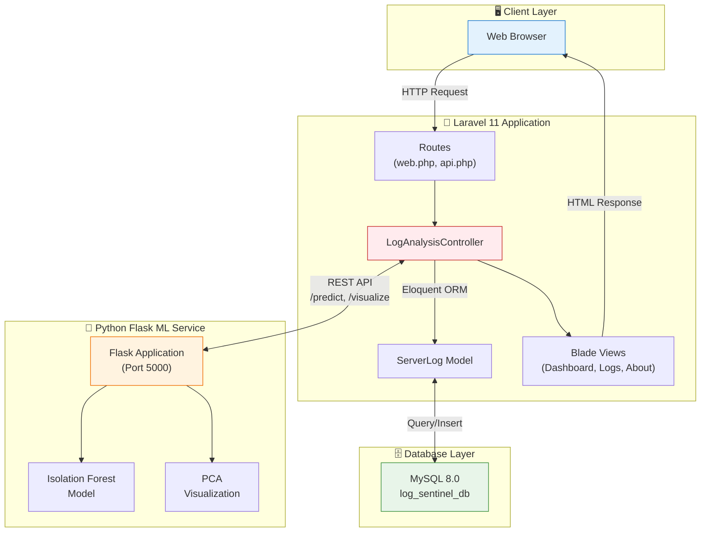
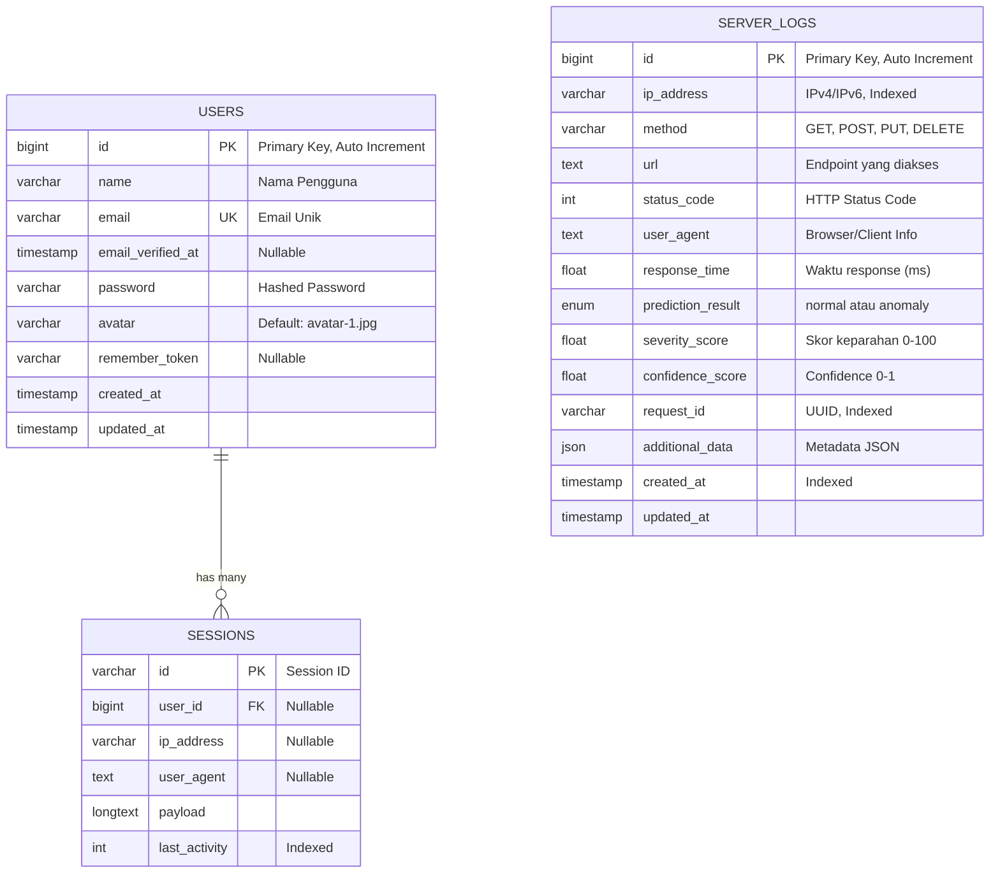
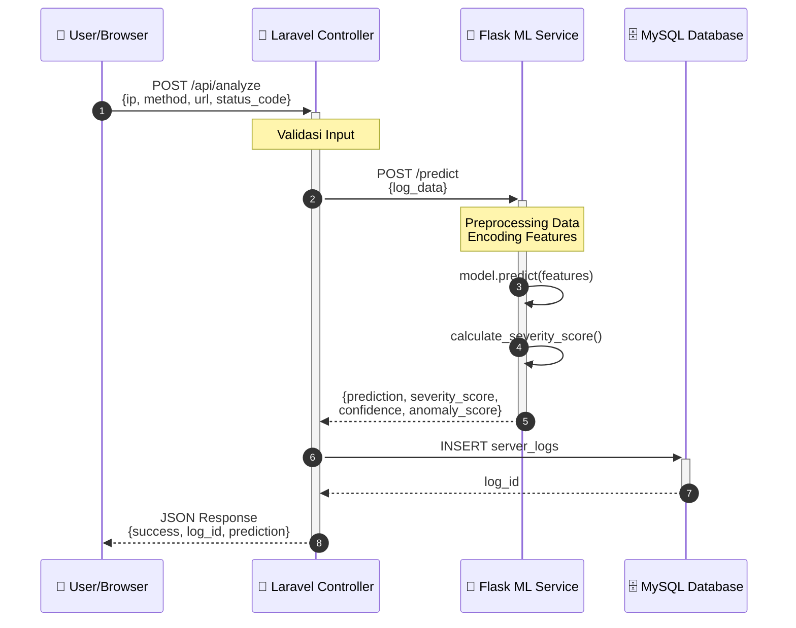
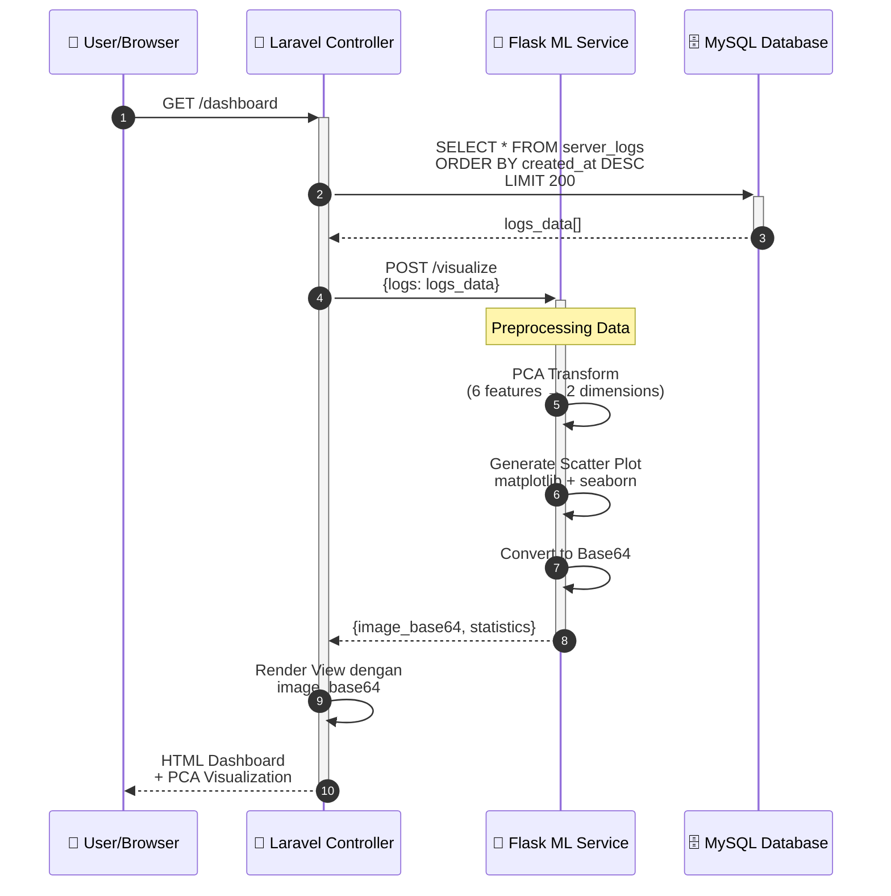
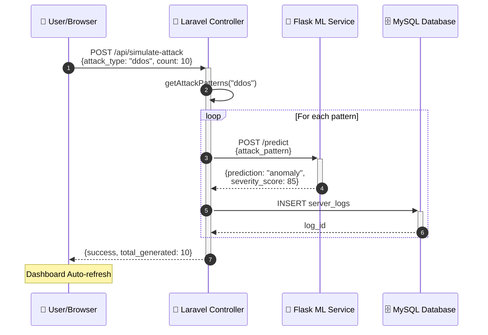

# 🛡️ Log Sentinel v3.0 - CTI Platform + Hybrid Adaptive Anomaly Detection

<div align="center">


**Cyber Threat Intelligence Platform + Hybrid Anomaly Detection with Explainable AI**

*Research Project - Artificial Intelligence Course*  
*State University of Jakarta (Universitas Negeri Jakarta)*

[Live Demo](#-screenshot-aplikasi) • [Installation](#-panduan-instalasi) • [API Docs](#-api-endpoints) • [Citation](#-citation)

</div>

---

## 📄 Abstract

Server log anomaly detection is a critical component of modern cybersecurity infrastructure. Traditional single-model approaches, while computationally efficient, suffer from high false positive rates and limited interpretability. This research presents **Log Sentinel v3.0**, a hybrid adaptive framework that addresses these limitations through four key contributions:

1. **Cyber Threat Intelligence (CTI) Platform**: A full STIX-inspired knowledge graph for managing threat actors, malware, campaigns, intrusion sets, vulnerabilities, and their relationships — inspired by OpenCTI.

2. **Multi-Model Ensemble Architecture**: Integration of Isolation Forest (IF), One-Class Support Vector Machine (OCSVM), and Local Outlier Factor (LOF) through a weighted majority voting mechanism, reducing single-model bias and improving detection robustness.

3. **SHAP-based Explainable AI (XAI)**: Implementation of SHapley Additive exPlanations using TreeExplainer to provide transparent, interpretable feature contribution analysis for each anomaly prediction.

4. **Temporal Sliding Window**: A 10-minute behavioral context window with 10 engineered temporal features (request frequency, error rate slope, method entropy, etc.) to capture time-series patterns missed by point-in-time analysis.

**Keywords**: Cyber Threat Intelligence, Anomaly Detection, Ensemble Learning, Explainable AI, SHAP, Knowledge Graph, STIX, MITRE ATT&CK

---

## 🔀 Dual-Mode Architecture (v3.0)

Log Sentinel v3.0 beroperasi dalam **dua mode** yang bisa di-switch via topbar:

| Mode | URL | Deskripsi |
|------|-----|-----------|
| **🛡️ CTI Platform** | `/cti` (default landing) | Knowledge graph, threat actors, malware, campaigns, cases, observations, MITRE ATT&CK |
| **📊 Log Sentinel** | `/sentinel/dashboard` | Real-time anomaly detection dashboard, log explorer, ML predictions |

### URL Reference

| Halaman | URL |
|---------|-----|
| **CTI Dashboard** | `/cti` |
| **Knowledge Entities** | `/knowledge/entities` |
| **Threat Actors** | `/threats/actors` |
| **Malware** | `/threats/malware` |
| **Campaigns** | `/threats/campaigns` |
| **Observations** | `/observations` |
| **Cases / Incidents** | `/cases/incidents` |
| **Graph Explorer** | `/knowledge/graph` |
| **MITRE ATT&CK** | `/knowledge/mitre` |
| **Ingestion** | `/ingestion/connectors` |
| **Settings** | `/settings/general` |
| **Diagnostics** | `/settings/diagnostics` |
| **Sentinel Dashboard** | `/sentinel/dashboard` |
| **Log Explorer** | `/sentinel/logs` |

### Troubleshooting

Kalau setelah login masih masuk ke dashboard lama:

```bash
php artisan sentinel:doctor
```

Command ini akan clear cache dan cek semua setup.

---

## 🔬 Methodology

### 2.1 Ensemble Voting Mechanism

The framework employs three complementary unsupervised learning algorithms:

| Algorithm | Strength | Weakness Addressed |
|-----------|----------|-------------------|
| **Isolation Forest** | Efficient for high-dimensional data | Poor on clustered anomalies |
| **One-Class SVM** | Robust boundary detection | Sensitive to kernel selection |
| **Local Outlier Factor** | Density-based local detection | Computationally expensive |

Final prediction is determined by weighted majority voting:

$$P_{final} = \begin{cases} \text{ANOMALY} & \text{if } \sum_{i=1}^{3} w_i \cdot p_i \geq \theta \\ \text{NORMAL} & \text{otherwise} \end{cases}$$

Where $w_i$ represents model weights and $\theta$ is the decision threshold.

### 2.2 Temporal Feature Engineering

The sliding window module extracts 10 behavioral features:

```
┌─────────────────────────────────────────────────────────┐
│                 10-Minute Sliding Window                 │
├─────────────────────────────────────────────────────────┤
│ 1. req_count_1min      │ Request count per IP (1 min)   │
│ 2. req_count_5min      │ Request count per IP (5 min)   │
│ 3. error_rate_1min     │ Error response ratio           │
│ 4. error_rate_slope    │ Error rate trend               │
│ 5. avg_response_time   │ Mean response latency          │
│ 6. unique_urls_1min    │ URL diversity metric           │
│ 7. method_entropy      │ HTTP method distribution       │
│ 8. global_req_count    │ Total system load              │
│ 9. global_error_rate   │ System-wide error ratio        │
│ 10. burst_score        │ Request spike indicator        │
└─────────────────────────────────────────────────────────┘
```

### 2.3 SHAP Explainability

Feature contributions are calculated using TreeExplainer:

$$\phi_i = \sum_{S \subseteq N \setminus \{i\}} \frac{|S|!(|N|-|S|-1)!}{|N|!} [f(S \cup \{i\}) - f(S)]$$

This provides human-readable explanations like:
> "Request flagged as ANOMALY due to: high request_count (+0.45), abnormal error_rate (+0.32), suspicious method_entropy (+0.18)"

---

## 📋 Research Team

### Lead Researcher & Developer
| Name | NPM | Role | GitHub |
|------|-----|------|--------|
| **Muhammad Akbar Hadi Pratama** | 237006516058 | Lead Researcher & Developer | [@el-pablos](https://github.com/el-pablos) |

### Original Contributors (Legacy Team)
| Name | NPM | Original Role |
|------|-----|---------------|
| Jeremy Christo Emmanuelle Panjaitan | 237006516084 | Initial Architecture |
| Farrel Alfaridzi | 237006516028 | Frontend Foundation |
| Chosmas Laurens Rumngewur | 217006516074 | Initial ML Implementation |

---

## 📖 System Description

**Log Sentinel v3.0** is an AI-powered cybersecurity platform combining **Cyber Threat Intelligence (CTI)** with **real-time anomaly detection**. The CTI module provides a STIX-inspired knowledge graph for threat management, while the anomaly detection engine uses a multi-model ensemble approach with explainable results.

### 🔬 Technical Innovations

| Innovation | Description | Scientific Contribution |
|-----------|-------------|------------------------|
| 🌐 **CTI Knowledge Graph** | STIX-inspired entity/relationship model with Cytoscape.js visualization | Full threat intelligence lifecycle management |
| 🧠 **Ensemble Voting Classifier** | Combines Isolation Forest, OCSVM, and LOF through weighted majority voting | Reduces single-model bias, improves detection robustness |
| 💡 **SHAP Explainability** | Uses TreeExplainer for feature contribution analysis | Enables transparent, interpretable security decisions |
| ⏱️ **Temporal Sliding Window** | 10-minute behavioral context with 10 engineered features | Captures temporal patterns missed by point-in-time analysis |
| 📊 **Real-time Forensic Visualization** | Interactive PCA scatter plot and threat mapping | Provides intuitive security situational awareness |

### ✨ Key Features

| Feature | Description |
|---------|-------------|
| 🌐 **CTI Platform** | STIX-inspired knowledge graph: threat actors, malware, campaigns, vulnerabilities |
| 📊 **Dual-Mode Dashboard** | Switch between CTI intelligence view and Log Sentinel anomaly detection |
| 🕸️ **Graph Explorer** | Cytoscape.js interactive graph visualization of entity relationships |
| 🛡️ **MITRE ATT&CK** | Import and map techniques from the ATT&CK framework |
| 📋 **Case Management** | Incident cases with tasks, entity linking, and timeline tracking |
| 🔍 **Observations** | SIEM-like enriched observations with confidence scoring |
| 🤖 **Multi-Model Ensemble** | IF + OCSVM + LOF with consensus scoring |
| 💡 **Explainable AI (XAI)** | SHAP-based feature importance visualization |
| ⏱️ **Temporal Analysis** | Sliding window with behavioral pattern detection |
| 🔌 **Data Connectors** | Pluggable ingestion from STIX bundles, MISP, AlienVault |
| 🔎 **Global Search** | Unified search across all entities, threats, cases |
| ✅ **79 Tests** | Comprehensive PHPUnit coverage for all modules |

---

## 🏗️ System Architecture

Sistem Log Sentinel menggunakan arsitektur **microservice** dengan pemisahan antara web application dan machine learning engine.


```mermaid
flowchart TB
    subgraph Client["🖥️ Client Layer"]
        Browser["Web Browser"]
    end
    
    subgraph Laravel["🔴 Laravel 11 Application"]
        direction TB
        Routes["Routes<br/>(web.php, api.php)"]
        Controller["LogAnalysisController"]
        Model["ServerLog Model"]
        Views["Blade Views<br/>(Dashboard, Logs, About)"]
    end
    
    subgraph Python["🐍 Python Flask ML Service"]
        direction TB
        FlaskApp["Flask Application<br/>(Port 5000)"]
        IsoForest["Isolation Forest<br/>Model"]
        PCA["PCA<br/>Visualization"]
    end
    
    subgraph Database["🗄️ Database Layer"]
        MySQL["MySQL 8.0<br/>log_sentinel_db"]
    end
    
    Browser -->|"HTTP Request"| Routes
    Routes --> Controller
    Controller -->|"Eloquent ORM"| Model
    Controller --> Views
    Views -->|"HTML Response"| Browser
    Model <-->|"Query/Insert"| MySQL
    
    Controller <-->|"REST API<br/>/predict, /visualize"| FlaskApp
    FlaskApp --> IsoForest
    FlaskApp --> PCA
    
    style Browser fill:#e3f2fd,stroke:#1976d2
    style Controller fill:#ffebee,stroke:#c62828
    style FlaskApp fill:#fff3e0,stroke:#ef6c00
    style MySQL fill:#e8f5e9,stroke:#388e3c
```

### Alur Komunikasi

1. **Client** → Mengirim request HTTP ke Laravel
2. **Laravel** → Memproses request, meneruskan ke ML Service jika perlu prediksi
3. **Flask ML** → Melakukan prediksi dengan Isolation Forest, mengembalikan hasil
4. **Laravel** → Menyimpan ke database, merender view dengan data
5. **Client** → Menerima response HTML dengan visualisasi

---

## 🗃️ Database Structure (ERD)

Database Log Sentinel terdiri dari beberapa tabel utama yang saling berelasi.


```mermaid
erDiagram
    USERS {
        bigint id PK "Primary Key, Auto Increment"
        varchar name "Nama Pengguna"
        varchar email UK "Email Unik"
        timestamp email_verified_at "Nullable"
        varchar password "Hashed Password"
        varchar avatar "Default: avatar-1.jpg"
        varchar remember_token "Nullable"
        timestamp created_at
        timestamp updated_at
    }
    
    SERVER_LOGS {
        bigint id PK "Primary Key, Auto Increment"
        varchar ip_address "IPv4/IPv6, Indexed"
        varchar method "GET, POST, PUT, DELETE"
        text url "Endpoint yang diakses"
        int status_code "HTTP Status Code"
        text user_agent "Browser/Client Info"
        float response_time "Waktu response (ms)"
        enum prediction_result "normal atau anomaly"
        float severity_score "Skor keparahan 0-100"
        float confidence_score "Confidence 0-1"
        varchar request_id "UUID, Indexed"
        json additional_data "Metadata JSON"
        timestamp created_at "Indexed"
        timestamp updated_at
    }
    
    SESSIONS {
        varchar id PK "Session ID"
        bigint user_id FK "Nullable"
        varchar ip_address "Nullable"
        text user_agent "Nullable"
        longtext payload
        int last_activity "Indexed"
    }
    
    USERS ||--o{ SESSIONS : "has many"
```

### Tabel Utama

| Tabel | Deskripsi | Jumlah Kolom |
|-------|-----------|--------------|
| `users` | Data pengguna sistem | 8 kolom |
| `server_logs` | Log server dengan hasil prediksi ML | 13 kolom |
| `sessions` | Sesi pengguna aktif | 6 kolom |

---

## 🔄 Process Flow (Sequence Diagram)

Berikut adalah alur proses saat pengguna melakukan analisis log atau simulasi serangan.

### Alur Analisis Log Baru


```mermaid
sequenceDiagram
    autonumber
    participant U as 👤 User/Browser
    participant L as 🔴 Laravel Controller
    participant F as 🐍 Flask ML Service
    participant DB as 🗄️ MySQL Database
    
    U->>+L: POST /api/analyze<br/>{ip, method, url, status_code}
    
    Note over L: Validasi Input
    
    L->>+F: POST /predict<br/>{log_data}
    
    Note over F: Preprocessing Data<br/>Encoding Features
    
    F->>F: model.predict(features)
    F->>F: calculate_severity_score()
    
    F-->>-L: {prediction, severity_score,<br/>confidence, anomaly_score}
    
    L->>+DB: INSERT server_logs
    DB-->>-L: log_id
    
    L-->>-U: JSON Response<br/>{success, log_id, prediction}
```

### Alur Visualisasi PCA


```mermaid
sequenceDiagram
    autonumber
    participant U as 👤 User/Browser
    participant L as 🔴 Laravel Controller
    participant F as 🐍 Flask ML Service
    participant DB as 🗄️ MySQL Database
    
    U->>+L: GET /dashboard
    
    L->>+DB: SELECT * FROM server_logs<br/>ORDER BY created_at DESC<br/>LIMIT 200
    DB-->>-L: logs_data[]
    
    L->>+F: POST /visualize<br/>{logs: logs_data}
    
    Note over F: Preprocessing Data
    F->>F: PCA Transform<br/>(6 features → 2 dimensions)
    F->>F: Generate Scatter Plot<br/>matplotlib + seaborn
    F->>F: Convert to Base64
    
    F-->>-L: {image_base64, statistics}
    
    L->>L: Render View dengan<br/>image_base64
    
    L-->>-U: HTML Dashboard<br/>+ PCA Visualization
```

### Alur Simulasi Serangan


```mermaid
sequenceDiagram
    autonumber
    participant U as 👤 User/Browser
    participant L as 🔴 Laravel Controller
    participant F as 🐍 Flask ML Service
    participant DB as 🗄️ MySQL Database
    
    U->>+L: POST /api/simulate-attack<br/>{attack_type: "ddos", count: 10}
    
    L->>L: getAttackPatterns("ddos")
    
    loop For each pattern
        L->>+F: POST /predict<br/>{attack_pattern}
        F-->>-L: {prediction: "anomaly",<br/>severity_score: 85}
        L->>+DB: INSERT server_logs
        DB-->>-L: log_id
    end
    
    L-->>-U: {success, total_generated: 10}
    
    Note over U: Dashboard Auto-refresh
```

---

## 🛠️ Tech Stack

### Backend & Frontend

| Teknologi | Versi | Penggunaan |
|-----------|-------|------------|
| PHP | 8.2+ | Backend Runtime |
| Laravel | 11.x | Web Framework |
| Velzon | 4.x | Admin Template |
| Bootstrap | 5.x | CSS Framework |
| ApexCharts | 3.x | Data Visualization |
| SweetAlert2 | 11.x | Alert & Modal |

### Machine Learning Service

| Teknologi | Versi | Penggunaan |
|-----------|-------|------------|
| Python | 3.10+ | ML Runtime |
| Flask | 3.0 | Web Framework |
| Scikit-Learn | 1.3+ | ML Algorithms |
| NumPy | 1.24+ | Numerical Computing |
| Pandas | 2.0+ | Data Processing |
| Matplotlib | 3.7+ | Plotting |
| Seaborn | 0.12+ | Statistical Visualization |

### Database & Testing

| Teknologi | Versi | Penggunaan |
|-----------|-------|------------|
| MySQL | 8.0+ | Production Database |
| SQLite | 3.x | Testing Database |
| PHPUnit | 10.x | PHP Unit Testing |

---

## 📸 Screenshot Aplikasi

> *Screenshot akan ditambahkan setelah deployment*

### Dashboard Utama
`[Screenshot: Dashboard dengan statistik dan chart]`

### PCA Visualization
`[Screenshot: Anomaly Distribution Map dengan scatter plot]`

### Live Monitoring
`[Screenshot: Tabel real-time log monitoring]`

### Halaman Login
`[Screenshot: Login page dengan branding Log Sentinel]`

---

## 📥 Panduan Instalasi

### Prasyarat Sistem

Pastikan sistem Anda telah terinstal:

- ✅ PHP 8.2 atau lebih tinggi
- ✅ Composer 2.x
- ✅ Node.js 18.x & NPM
- ✅ Python 3.10 atau lebih tinggi
- ✅ MySQL 8.0 atau lebih tinggi
- ✅ Git

### Step 1: Clone Repository

```bash
git clone https://github.com/el-pablos/uas-kecerdasan-artifisial-kel3.git
cd uas-kecerdasan-artifisial-kel3
```

### Step 2: Setup Python ML Service

```bash
# Masuk ke direktori ml_service
cd ml_service

# Buat virtual environment
python -m venv venv

# Aktifkan virtual environment
# Windows:
.\venv\Scripts\activate
# Linux/Mac:
source venv/bin/activate

# Install dependencies
pip install -r requirements.txt

# Kembali ke root directory
cd ..
```

### Step 3: Setup Laravel Backend

```bash
# Install PHP dependencies
composer install

# Install Node.js dependencies
npm install

# Build frontend assets
npm run build

# Copy environment file
cp .env.example .env

# Generate application key
php artisan key:generate
```

### Step 4: Konfigurasi Database

Edit file `.env` dan sesuaikan konfigurasi:

```env
DB_CONNECTION=mysql
DB_HOST=127.0.0.1
DB_PORT=3306
DB_DATABASE=log_sentinel_db
DB_USERNAME=root
DB_PASSWORD=

ML_SERVICE_URL=http://127.0.0.1:5000
```

Buat database di MySQL:

```sql
CREATE DATABASE log_sentinel_db CHARACTER SET utf8mb4 COLLATE utf8mb4_unicode_ci;
```

### Step 5: Migrasi & Seeding

```bash
php artisan migrate --seed
```

Seeder akan membuat:
- 1 user admin untuk demo
- 20 dummy server logs (campuran normal dan anomaly)

### Step 6: Jalankan Aplikasi

**Terminal 1 - Python ML Service:**

```bash
cd ml_service
.\venv\Scripts\activate      # Windows
# source venv/bin/activate   # Linux/Mac

python app.py
```

Output yang diharapkan:
```
==================================================
  LOG SENTINEL - ML SERVICE
  Anomaly Detection System
==================================================
  🚀 Server berjalan di http://127.0.0.1:5000
  📊 Algorithm: Isolation Forest
==================================================
```

**Terminal 2 - Laravel Server:**

```bash
php artisan serve
```

### Step 7: Akses Dashboard

Buka browser: **http://127.0.0.1:8000**

Setelah login, akan langsung masuk ke **CTI Dashboard** (`/cti`).  
Untuk anomaly detection, klik **SWITCH MODE** di topbar → pilih **Log Sentinel**.

Jika masih masuk ke dashboard lama, jalankan:
```bash
php artisan sentinel:doctor
```

---

## 🔐 Kredensial Demo

| Field | Value |
|-------|-------|
| **Email** | `admin@logsentinel.com` |
| **Password** | `password` |

---

## 🔌 API Endpoints

### Authentication

Semua endpoint API tidak memerlukan autentikasi (public access).

### Endpoints

| Method | Endpoint | Deskripsi |
|--------|----------|-----------|
| `POST` | `/api/analyze` | Analisis log baru dengan ML |
| `GET` | `/api/recent-logs` | Ambil log terbaru |
| `GET` | `/api/stats` | Statistik dashboard |
| `GET` | `/api/chart-data` | Data untuk chart |
| `POST` | `/api/simulate-attack` | Simulasi serangan untuk demo |

### Contoh Request

#### Analyze Log

```bash
curl -X POST http://127.0.0.1:8000/api/analyze \
  -H "Content-Type: application/json" \
  -d '{
    "ip_address": "192.168.1.100",
    "method": "GET",
    "url": "/api/users",
    "status_code": 200,
    "user_agent": "Mozilla/5.0",
    "response_time": 150.5
  }'
```

**Response:**

```json
{
  "success": true,
  "message": "Log berhasil dianalisis",
  "data": {
    "log_id": 25,
    "request_id": "550e8400-e29b-41d4-a716-446655440000",
    "prediction": "normal",
    "severity_score": 0,
    "is_anomaly": false
  }
}
```

#### Simulate Attack

```bash
curl -X POST http://127.0.0.1:8000/api/simulate-attack \
  -H "Content-Type: application/json" \
  -d '{
    "attack_type": "ddos",
    "count": 5
  }'
```

**Tipe Attack yang Tersedia:**
- `ddos` - DDoS Attack simulation
- `bruteforce` - Brute Force Login attempt
- `sql_injection` - SQL Injection patterns
- `path_traversal` - Directory traversal attempts
- `random` - Random mixed attacks

---

## 🧪 Testing

### Menjalankan Test

```bash
# Semua test
php artisan test

# Dengan output detail
php artisan test --verbose

# Test spesifik
php artisan test --filter=ServerLogModelTest
php artisan test --filter=SecurityTest
```

### Hasil Test

```
Tests:    79 passed (269 assertions)

✅ Unit Tests (10)
   - ServerLogModelTest: 9 tests
   - ExampleTest: 1 test

✅ Feature Tests (69)
   - ApiEndpointsTest: 7 tests
   - DashboardTest: 9 tests
   - SecurityTest: 13 tests
   - CtiEntrypointTest: 10 tests
   - GraphServiceTest: 10 tests
   - ThreatsModuleTest: 10 tests
   - ObservationsModuleTest: 6 tests
   - CasesModuleTest: 8 tests
   - MitreAttackTest: 4 tests
   - ExampleTest: 1 test
   - ConnectorJobTest: 1 test
```

### Coverage

| Area | Test Count | Status |
|------|------------|--------|
| CTI Entrypoint & Routing | 10 | ✅ Pass |
| Graph Service | 10 | ✅ Pass |
| Threats Module | 10 | ✅ Pass |
| Cases Module | 8 | ✅ Pass |
| Observations | 6 | ✅ Pass |
| API Endpoints | 7 | ✅ Pass |
| Dashboard Views | 9 | ✅ Pass |
| Security (Auth) | 13 | ✅ Pass |
| MITRE ATT&CK | 4 | ✅ Pass |
| Model (ServerLog) | 9 | ✅ Pass |
| Other | 3 | ✅ Pass |

---

## 📁 Struktur Proyek

```
uas-kecerdasan-artifisial-kel3/
├── 📂 app/
│   ├── Http/Controllers/
│   │   ├── CtiDashboardController.php  # CTI dashboard with KPI stats
│   │   ├── KnowledgeController.php     # Entities CRUD + Graph explorer
│   │   ├── ThreatsController.php       # Threat actors, malware, campaigns
│   │   ├── ObservationsController.php  # Observations / indicators
│   │   ├── CasesController.php         # Case/incident management
│   │   ├── InvestigationsController.php# Investigation workspace
│   │   ├── IngestionController.php     # STIX import, connectors
│   │   ├── SearchController.php        # Global search
│   │   ├── SettingsController.php      # Settings + diagnostics
│   │   └── LogAnalysisController.php   # Sentinel anomaly detection
│   ├── Models/
│   │   ├── Node.php                    # Knowledge graph entity (STIX)
│   │   ├── Edge.php                    # Entity relationship
│   │   ├── CaseModel.php              # Incident case
│   │   ├── CaseTask.php               # Case task
│   │   ├── CaseItem.php               # Case-entity link
│   │   ├── Integration.php            # Data connector
│   │   ├── Tag.php / Taggable.php     # Tagging system
│   │   ├── ActivityLog.php            # Audit trail
│   │   └── ServerLog.php              # Anomaly detection log
│   ├── Services/
│   │   └── GraphService.php           # Cytoscape.js graph builder
│   ├── Jobs/
│   │   └── ConnectorJob.php           # Async data ingestion
│   └── Console/Commands/
│       └── SentinelDoctor.php         # sentinel:doctor CLI tool
│
├── 📂 resources/views/
│   ├── layouts/
│   │   ├── master-cti.blade.php       # CTI layout (dark theme)
│   │   ├── master.blade.php           # Sentinel layout
│   │   ├── sidebar-cti.blade.php      # CTI sidebar navigation
│   │   ├── sidebar-sentinel.blade.php # Sentinel sidebar
│   │   ├── topbar.blade.php           # Shared topbar + mode switcher
│   │   └── mode-switcher.blade.php    # CTI/Sentinel toggle
│   ├── cti/
│   │   ├── dashboard/index.blade.php  # CTI dashboard (landing page)
│   │   ├── knowledge/                 # Entities, graph, MITRE ATT&CK
│   │   ├── threats/                   # Actors, malware, campaigns
│   │   ├── observations/              # Observations
│   │   ├── cases/                     # Incidents, tasks
│   │   └── settings/                  # Settings + diagnostics
│   └── sentinel/
│       ├── dashboard.blade.php        # Anomaly detection dashboard
│       └── logs.blade.php             # Log explorer
│
├── 📂 ml_service/                     # Python ML Microservice
│   ├── app.py                         # Flask + Ensemble models
│   ├── ensemble_voting.py             # IF + OCSVM + LOF
│   ├── shap_explainer.py              # SHAP TreeExplainer
│   ├── temporal_features.py           # Sliding window features
│   └── tests/                         # Python ML tests
│
├── 📂 tests/
│   ├── Feature/
│   │   ├── CtiEntrypointTest.php      # CTI routing & layout tests
│   │   ├── GraphServiceTest.php       # Knowledge graph tests
│   │   ├── ThreatsModuleTest.php      # Threats CRUD tests
│   │   ├── ObservationsModuleTest.php # Observations tests
│   │   ├── CasesModuleTest.php        # Case management tests
│   │   ├── MitreAttackTest.php        # MITRE ATT&CK import tests
│   │   ├── DashboardTest.php          # Sentinel dashboard tests
│   │   ├── SecurityTest.php           # Auth & RBAC tests
│   │   └── ApiEndpointsTest.php       # API endpoint tests
│   └── Unit/
│       └── ServerLogModelTest.php
│
├── 📂 routes/
│   ├── web.php                        # All web routes (CTI + Sentinel)
│   └── api.php                        # API routes
│
└── 📂 docs/
    ├── ROOT_CAUSE_UI.md               # UI audit findings
    └── UPGRADE_PLAN.md                # v2 → v3 upgrade plan
```

---

## 🧠 Algoritma Machine Learning

### Isolation Forest

**Isolation Forest** adalah algoritma unsupervised learning yang efektif untuk deteksi anomali. Algoritma ini bekerja dengan prinsip:

- **Anomali** adalah data yang "berbeda" dan lebih mudah diisolasi
- **Data normal** membutuhkan lebih banyak partisi untuk diisolasi
- Menggunakan ensemble dari decision trees yang dibangun secara random

### Parameter Model

```python
IsolationForest(
    n_estimators=100,      # Jumlah pohon dalam forest
    contamination=0.1,     # Proporsi outlier (10%)
    max_samples='auto',    # Sampel per pohon
    random_state=42,       # Reproducibility
    n_jobs=-1              # Parallel processing
)
```

### Fitur yang Dianalisis

| Fitur | Tipe | Deskripsi |
|-------|------|-----------|
| `ip_numeric` | Integer | Hash dari IP address |
| `method_encoded` | Integer | Encoded HTTP method |
| `status_code` | Integer | HTTP status code |
| `response_time` | Float | Response time (ms) |
| `url_length` | Integer | Panjang URL |
| `user_agent_idx` | Integer | Index user agent |

### PCA Visualization

**Principal Component Analysis (PCA)** digunakan untuk mereduksi 6 fitur menjadi 2 dimensi sehingga dapat divisualisasikan dalam scatter plot.

```python
PCA(n_components=2, random_state=42)
```

**Output:** Scatter plot dengan titik biru (normal) dan merah (anomaly).

---

## 🚨 Jenis Ancaman yang Terdeteksi

| Jenis Serangan | Indikator | Severity |
|----------------|-----------|----------|
| **DDoS Attack** | Response time tinggi, status 503, traffic flood | High (80-95) |
| **Brute Force** | Multiple failed login attempts, status 401/403 | High (75-90) |
| **SQL Injection** | Suspicious query patterns, special chars in URL | Medium-High (70-85) |
| **Path Traversal** | `../` patterns, access to sensitive paths | Medium (60-75) |
| **Port Scanning** | Sequential 404 errors, enumeration patterns | Medium (50-70) |

---

## 📜 Lisensi

Proyek ini dibuat untuk keperluan akademis pada mata kuliah **Kecerdasan Artifisial**.

---

<div align="center">

### 🎓 Log Sentinel Team

**© 2026 - Ujian Akhir Semester Kecerdasan Artifisial**

*Universitas Negeri Jakarta*

---

Made with ❤️ by Kelompok 3

</div>
