# 🛡️ Log Sentinel v2.0 - Hybrid Adaptive Anomaly Detection Framework

<div align="center">


**Hybrid Adaptive Anomaly Detection Framework with Explainable AI & Real-Time Forensic Visualization**

*Research Project - Artificial Intelligence Course*  
*State University of Jakarta (Universitas Negeri Jakarta)*

[Live Demo](#-screenshot-aplikasi) • [Installation](#-panduan-instalasi) • [API Docs](#-api-endpoints) • [Research Team](#-tim-pengembang)

</div>

---

## 🔬 Research Abstract

This research presents **Log Sentinel v2.0**, a hybrid adaptive framework for server log anomaly detection that addresses the limitations of single-model approaches in cybersecurity threat identification. The framework integrates three complementary unsupervised learning algorithms—**Isolation Forest**, **One-Class SVM**, and **Local Outlier Factor**—through an ensemble voting mechanism to achieve robust multi-perspective anomaly detection. 

Key innovations include:
- **SHAP-based Explainable AI (XAI)** for transparent model decision interpretation
- **Temporal Sliding Window** for behavioral context-aware detection
- **Real-time forensic visualization** with interactive threat mapping

The system demonstrates improved detection accuracy and reduced false positive rates compared to standalone Isolation Forest implementations.

---

## 📋 Research Team

### Lead Researcher & Developer
| Name | NPM | Role | GitHub |
|------|-----|------|--------|
| **Muhammad Akbar Hadi Pratama** | 237006516058 | Lead Researcher & Developer | [@el-pablos](https://github.com/el-pablos) |

### Original Contributors (Legacy Team)
| Name | NPM | Original Role |
|------|-----|---------------|
| Jeremy Christo Emmanuelle Panjaitan | 237006516084 | Initial Architecture |
| Farrel Alfaridzi | 237006516028 | Frontend Foundation |
| Chosmas Laurens Rumngewur | 217006516074 | Initial ML Implementation |

---

## 📖 System Description

**Log Sentinel v2.0** is an advanced AI-powered anomaly detection system designed for real-time server log analysis and cybersecurity threat identification. The framework employs a multi-model ensemble approach to achieve robust detection with explainable results.

### 🔬 Technical Innovations

| Innovation | Description | Scientific Contribution |
|-----------|-------------|------------------------|
| 🧠 **Ensemble Voting Classifier** | Combines Isolation Forest, OCSVM, and LOF through weighted majority voting | Reduces single-model bias, improves detection robustness |
| 💡 **SHAP Explainability** | Uses TreeExplainer for feature contribution analysis | Enables transparent, interpretable security decisions |
| ⏱️ **Temporal Sliding Window** | 10-minute behavioral context with 10 engineered features | Captures temporal patterns missed by point-in-time analysis |
| 📊 **Real-time Forensic Visualization** | Interactive PCA scatter plot and threat mapping | Provides intuitive security situational awareness |

### ✨ Key Features

| Feature | Description |
|---------|-------------|
| 📊 **Cybersecurity Command Center** | Dark-themed dashboard with real-time threat visualization |
| 🤖 **Multi-Model Ensemble** | IF + OCSVM + LOF with consensus scoring |
| 💡 **Explainable AI (XAI)** | SHAP-based feature importance visualization |
| ⏱️ **Temporal Analysis** | Sliding window with behavioral pattern detection |
| 🎯 **Attack Simulation** | DDoS, Brute Force, SQL Injection, Path Traversal |
| 🔍 **Threat Level Classification** | NORMAL → SUSPICIOUS → HIGH → CRITICAL |
| 📈 **PCA Visualization** | 2D scatter plot for anomaly distribution mapping |
| ✅ **39 Unit Tests** | Comprehensive pytest coverage for ML components |

---

## 🏗️ System Architecture

Sistem Log Sentinel menggunakan arsitektur **microservice** dengan pemisahan antara web application dan machine learning engine.

```mermaid
flowchart TB
    subgraph Client["🖥️ Client Layer"]
        Browser["Web Browser"]
    end
    
    subgraph Laravel["🔴 Laravel 11 Application"]
        direction TB
        Routes["Routes<br/>(web.php, api.php)"]
        Controller["LogAnalysisController"]
        Model["ServerLog Model"]
        Views["Blade Views<br/>(Dashboard, Logs, About)"]
    end
    
    subgraph Python["🐍 Python Flask ML Service"]
        direction TB
        FlaskApp["Flask Application<br/>(Port 5000)"]
        IsoForest["Isolation Forest<br/>Model"]
        PCA["PCA<br/>Visualization"]
    end
    
    subgraph Database["🗄️ Database Layer"]
        MySQL["MySQL 8.0<br/>log_sentinel_db"]
    end
    
    Browser -->|"HTTP Request"| Routes
    Routes --> Controller
    Controller -->|"Eloquent ORM"| Model
    Controller --> Views
    Views -->|"HTML Response"| Browser
    Model <-->|"Query/Insert"| MySQL
    
    Controller <-->|"REST API<br/>/predict, /visualize"| FlaskApp
    FlaskApp --> IsoForest
    FlaskApp --> PCA
    
    style Browser fill:#e3f2fd,stroke:#1976d2
    style Controller fill:#ffebee,stroke:#c62828
    style FlaskApp fill:#fff3e0,stroke:#ef6c00
    style MySQL fill:#e8f5e9,stroke:#388e3c
```



### Alur Komunikasi

1. **Client** → Mengirim request HTTP ke Laravel
2. **Laravel** → Memproses request, meneruskan ke ML Service jika perlu prediksi
3. **Flask ML** → Melakukan prediksi dengan Isolation Forest, mengembalikan hasil
4. **Laravel** → Menyimpan ke database, merender view dengan data
5. **Client** → Menerima response HTML dengan visualisasi

---

## 🗃️ Database Structure (ERD)

Database Log Sentinel terdiri dari beberapa tabel utama yang saling berelasi.


### Tabel Utama

| Tabel | Deskripsi | Jumlah Kolom |
|-------|-----------|--------------|
| `users` | Data pengguna sistem | 8 kolom |
| `server_logs` | Log server dengan hasil prediksi ML | 13 kolom |
| `sessions` | Sesi pengguna aktif | 6 kolom |

---

## 🔄 Process Flow (Sequence Diagram)

Berikut adalah alur proses saat pengguna melakukan analisis log atau simulasi serangan.

### Alur Analisis Log Baru

```mermaid
sequenceDiagram
    autonumber
    participant U as 👤 User/Browser
    participant L as 🔴 Laravel Controller
    participant F as 🐍 Flask ML Service
    participant DB as 🗄️ MySQL Database
    
    U->>+L: POST /api/analyze<br/>{ip, method, url, status_code}
    
    Note over L: Validasi Input
    
    L->>+F: POST /predict<br/>{log_data}
    
    Note over F: Preprocessing Data<br/>Encoding Features
    
    F->>F: model.predict(features)
    F->>F: calculate_severity_score()
    
    F-->>-L: {prediction, severity_score,<br/>confidence, anomaly_score}
    
    L->>+DB: INSERT server_logs
    DB-->>-L: log_id
    
    L-->>-U: JSON Response<br/>{success, log_id, prediction}
```



### Alur Visualisasi PCA

```mermaid
sequenceDiagram
    autonumber
    participant U as 👤 User/Browser
    participant L as 🔴 Laravel Controller
    participant F as 🐍 Flask ML Service
    participant DB as 🗄️ MySQL Database
    
    U->>+L: GET /dashboard
    
    L->>+DB: SELECT * FROM server_logs<br/>ORDER BY created_at DESC<br/>LIMIT 200
    DB-->>-L: logs_data[]
    
    L->>+F: POST /visualize<br/>{logs: logs_data}
    
    Note over F: Preprocessing Data
    F->>F: PCA Transform<br/>(6 features → 2 dimensions)
    F->>F: Generate Scatter Plot<br/>matplotlib + seaborn
    F->>F: Convert to Base64
    
    F-->>-L: {image_base64, statistics}
    
    L->>L: Render View dengan<br/>image_base64
    
    L-->>-U: HTML Dashboard<br/>+ PCA Visualization
```



### Alur Simulasi Serangan

```mermaid
sequenceDiagram
    autonumber
    participant U as 👤 User/Browser
    participant L as 🔴 Laravel Controller
    participant F as 🐍 Flask ML Service
    participant DB as 🗄️ MySQL Database
    
    U->>+L: POST /api/simulate-attack<br/>{attack_type: "ddos", count: 10}
    
    L->>L: getAttackPatterns("ddos")
    
    loop For each pattern
        L->>+F: POST /predict<br/>{attack_pattern}
        F-->>-L: {prediction: "anomaly",<br/>severity_score: 85}
        L->>+DB: INSERT server_logs
        DB-->>-L: log_id
    end
    
    L-->>-U: {success, total_generated: 10}
    
    Note over U: Dashboard Auto-refresh
```



---

## 🛠️ Tech Stack

### Backend & Frontend

| Teknologi | Versi | Penggunaan |
|-----------|-------|------------|
| PHP | 8.2+ | Backend Runtime |
| Laravel | 11.x | Web Framework |
| Velzon | 4.x | Admin Template |
| Bootstrap | 5.x | CSS Framework |
| ApexCharts | 3.x | Data Visualization |
| SweetAlert2 | 11.x | Alert & Modal |

### Machine Learning Service

| Teknologi | Versi | Penggunaan |
|-----------|-------|------------|
| Python | 3.10+ | ML Runtime |
| Flask | 3.0 | Web Framework |
| Scikit-Learn | 1.3+ | ML Algorithms |
| NumPy | 1.24+ | Numerical Computing |
| Pandas | 2.0+ | Data Processing |
| Matplotlib | 3.7+ | Plotting |
| Seaborn | 0.12+ | Statistical Visualization |

### Database & Testing

| Teknologi | Versi | Penggunaan |
|-----------|-------|------------|
| MySQL | 8.0+ | Production Database |
| SQLite | 3.x | Testing Database |
| PHPUnit | 10.x | PHP Unit Testing |

---

## 📸 Screenshot Aplikasi

> *Screenshot akan ditambahkan setelah deployment*

### Dashboard Utama
`[Screenshot: Dashboard dengan statistik dan chart]`

### PCA Visualization
`[Screenshot: Anomaly Distribution Map dengan scatter plot]`

### Live Monitoring
`[Screenshot: Tabel real-time log monitoring]`

### Halaman Login
`[Screenshot: Login page dengan branding Log Sentinel]`

---

## 📥 Panduan Instalasi

### Prasyarat Sistem

Pastikan sistem Anda telah terinstal:

- ✅ PHP 8.2 atau lebih tinggi
- ✅ Composer 2.x
- ✅ Node.js 18.x & NPM
- ✅ Python 3.10 atau lebih tinggi
- ✅ MySQL 8.0 atau lebih tinggi
- ✅ Git

### Step 1: Clone Repository

```bash
git clone https://github.com/el-pablos/uas-kecerdasan-artifisial-kel3.git
cd uas-kecerdasan-artifisial-kel3
```

### Step 2: Setup Python ML Service

```bash
# Masuk ke direktori ml_service
cd ml_service

# Buat virtual environment
python -m venv venv

# Aktifkan virtual environment
# Windows:
.\venv\Scripts\activate
# Linux/Mac:
source venv/bin/activate

# Install dependencies
pip install -r requirements.txt

# Kembali ke root directory
cd ..
```

### Step 3: Setup Laravel Backend

```bash
# Install PHP dependencies
composer install

# Install Node.js dependencies
npm install

# Build frontend assets
npm run build

# Copy environment file
cp .env.example .env

# Generate application key
php artisan key:generate
```

### Step 4: Konfigurasi Database

Edit file `.env` dan sesuaikan konfigurasi:

```env
DB_CONNECTION=mysql
DB_HOST=127.0.0.1
DB_PORT=3306
DB_DATABASE=log_sentinel_db
DB_USERNAME=root
DB_PASSWORD=

ML_SERVICE_URL=http://127.0.0.1:5000
```

Buat database di MySQL:

```sql
CREATE DATABASE log_sentinel_db CHARACTER SET utf8mb4 COLLATE utf8mb4_unicode_ci;
```

### Step 5: Migrasi & Seeding

```bash
php artisan migrate --seed
```

Seeder akan membuat:
- 1 user admin untuk demo
- 20 dummy server logs (campuran normal dan anomaly)

### Step 6: Jalankan Aplikasi

**Terminal 1 - Python ML Service:**

```bash
cd ml_service
.\venv\Scripts\activate      # Windows
# source venv/bin/activate   # Linux/Mac

python app.py
```

Output yang diharapkan:
```
==================================================
  LOG SENTINEL - ML SERVICE
  Anomaly Detection System
==================================================
  🚀 Server berjalan di http://127.0.0.1:5000
  📊 Algorithm: Isolation Forest
==================================================
```

**Terminal 2 - Laravel Server:**

```bash
php artisan serve
```

### Step 7: Akses Dashboard

Buka browser: **http://127.0.0.1:8000**

---

## 🔐 Kredensial Demo

| Field | Value |
|-------|-------|
| **Email** | `admin@logsentinel.com` |
| **Password** | `password` |

---

## 🔌 API Endpoints

### Authentication

Semua endpoint API tidak memerlukan autentikasi (public access).

### Endpoints

| Method | Endpoint | Deskripsi |
|--------|----------|-----------|
| `POST` | `/api/analyze` | Analisis log baru dengan ML |
| `GET` | `/api/recent-logs` | Ambil log terbaru |
| `GET` | `/api/stats` | Statistik dashboard |
| `GET` | `/api/chart-data` | Data untuk chart |
| `POST` | `/api/simulate-attack` | Simulasi serangan untuk demo |

### Contoh Request

#### Analyze Log

```bash
curl -X POST http://127.0.0.1:8000/api/analyze \
  -H "Content-Type: application/json" \
  -d '{
    "ip_address": "192.168.1.100",
    "method": "GET",
    "url": "/api/users",
    "status_code": 200,
    "user_agent": "Mozilla/5.0",
    "response_time": 150.5
  }'
```

**Response:**

```json
{
  "success": true,
  "message": "Log berhasil dianalisis",
  "data": {
    "log_id": 25,
    "request_id": "550e8400-e29b-41d4-a716-446655440000",
    "prediction": "normal",
    "severity_score": 0,
    "is_anomaly": false
  }
}
```

#### Simulate Attack

```bash
curl -X POST http://127.0.0.1:8000/api/simulate-attack \
  -H "Content-Type: application/json" \
  -d '{
    "attack_type": "ddos",
    "count": 5
  }'
```

**Tipe Attack yang Tersedia:**
- `ddos` - DDoS Attack simulation
- `bruteforce` - Brute Force Login attempt
- `sql_injection` - SQL Injection patterns
- `path_traversal` - Directory traversal attempts
- `random` - Random mixed attacks

---

## 🧪 Testing

### Menjalankan Test

```bash
# Semua test
php artisan test

# Dengan output detail
php artisan test --verbose

# Test spesifik
php artisan test --filter=ServerLogModelTest
php artisan test --filter=SecurityTest
```

### Hasil Test

```
Tests:    40 passed (151 assertions)
Duration: 2.54s

✅ Unit Tests (10)
   - ServerLogModelTest: 9 tests
   - ExampleTest: 1 test

✅ Feature Tests (30)
   - ApiEndpointsTest: 7 tests
   - DashboardTest: 9 tests
   - SecurityTest: 13 tests
   - ExampleTest: 1 test
```

### Coverage

| Area | Test Count | Status |
|------|------------|--------|
| API Endpoints | 7 | ✅ Pass |
| Dashboard Views | 9 | ✅ Pass |
| Security (Auth) | 13 | ✅ Pass |
| Model (ServerLog) | 9 | ✅ Pass |
| Other | 2 | ✅ Pass |

---

## 📁 Struktur Proyek

```
uas-kecerdasan-artifisial-kel3/
├── 📂 app/
│   ├── Http/Controllers/
│   │   └── LogAnalysisController.php   # Main controller
│   └── Models/
│       └── ServerLog.php               # Eloquent model
│
├── 📂 database/
│   ├── factories/
│   │   └── ServerLogFactory.php        # Factory for testing
│   ├── migrations/
│   │   └── *_create_server_logs_table.php
│   └── seeders/
│       └── DatabaseSeeder.php          # Demo data seeder
│
├── 📂 ml_service/                      # Python ML Microservice
│   ├── app.py                          # Flask + Isolation Forest
│   ├── requirements.txt                # Python dependencies
│   └── venv/                           # Virtual environment
│
├── 📂 resources/views/
│   ├── layouts/
│   │   └── topbar.blade.php            # Navigation header
│   ├── sentinel/
│   │   ├── dashboard.blade.php         # Main dashboard
│   │   ├── logs.blade.php              # Log listing
│   │   └── about.blade.php             # About team
│   └── auth/
│       └── login.blade.php             # Login page
│
├── 📂 routes/
│   ├── web.php                         # Web routes
│   └── api.php                         # API routes
│
├── 📂 tests/
│   ├── Feature/
│   │   ├── ApiEndpointsTest.php
│   │   ├── DashboardTest.php
│   │   └── SecurityTest.php
│   └── Unit/
│       └── ServerLogModelTest.php
│
├── 📄 .env.example                     # Environment template
├── 📄 composer.json                    # PHP dependencies
├── 📄 package.json                     # Node dependencies
└── 📄 README.md                        # Documentation
```

---

## 🧠 Algoritma Machine Learning

### Isolation Forest

**Isolation Forest** adalah algoritma unsupervised learning yang efektif untuk deteksi anomali. Algoritma ini bekerja dengan prinsip:

- **Anomali** adalah data yang "berbeda" dan lebih mudah diisolasi
- **Data normal** membutuhkan lebih banyak partisi untuk diisolasi
- Menggunakan ensemble dari decision trees yang dibangun secara random

### Parameter Model

```python
IsolationForest(
    n_estimators=100,      # Jumlah pohon dalam forest
    contamination=0.1,     # Proporsi outlier (10%)
    max_samples='auto',    # Sampel per pohon
    random_state=42,       # Reproducibility
    n_jobs=-1              # Parallel processing
)
```

### Fitur yang Dianalisis

| Fitur | Tipe | Deskripsi |
|-------|------|-----------|
| `ip_numeric` | Integer | Hash dari IP address |
| `method_encoded` | Integer | Encoded HTTP method |
| `status_code` | Integer | HTTP status code |
| `response_time` | Float | Response time (ms) |
| `url_length` | Integer | Panjang URL |
| `user_agent_idx` | Integer | Index user agent |

### PCA Visualization

**Principal Component Analysis (PCA)** digunakan untuk mereduksi 6 fitur menjadi 2 dimensi sehingga dapat divisualisasikan dalam scatter plot.

```python
PCA(n_components=2, random_state=42)
```

**Output:** Scatter plot dengan titik biru (normal) dan merah (anomaly).

---

## 🚨 Jenis Ancaman yang Terdeteksi

| Jenis Serangan | Indikator | Severity |
|----------------|-----------|----------|
| **DDoS Attack** | Response time tinggi, status 503, traffic flood | High (80-95) |
| **Brute Force** | Multiple failed login attempts, status 401/403 | High (75-90) |
| **SQL Injection** | Suspicious query patterns, special chars in URL | Medium-High (70-85) |
| **Path Traversal** | `../` patterns, access to sensitive paths | Medium (60-75) |
| **Port Scanning** | Sequential 404 errors, enumeration patterns | Medium (50-70) |

---

## 📜 Lisensi

Proyek ini dibuat untuk keperluan akademis pada mata kuliah **Kecerdasan Artifisial**.

---

<div align="center">

### 🎓 Log Sentinel Team

**© 2026 - Ujian Akhir Semester Kecerdasan Artifisial**

*Universitas Negeri Jakarta*

---

Made with ❤️ by Kelompok 3

</div>
